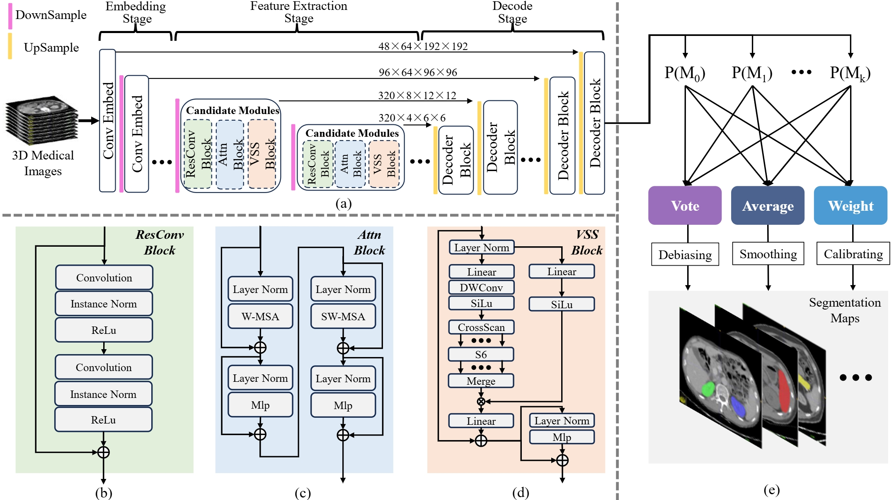
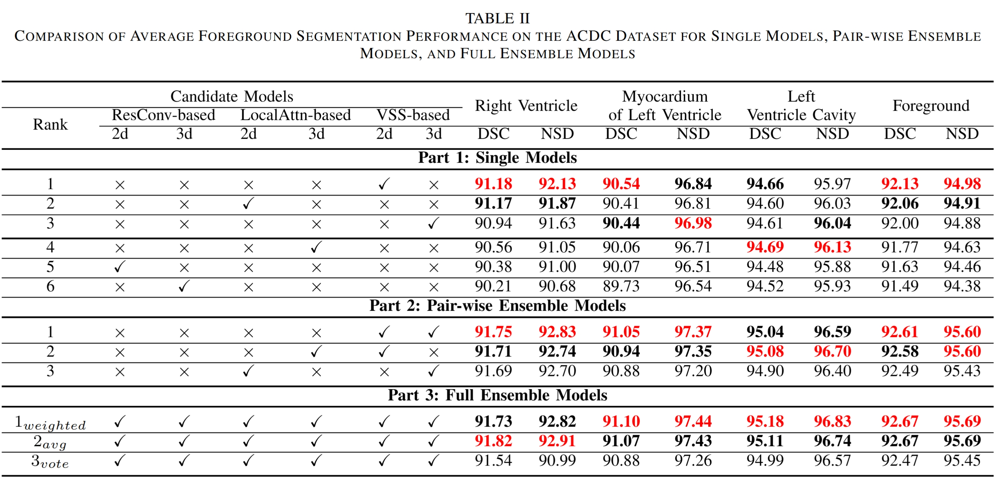

## Title

Bridging Model-Specific Gaps in 3D Medical Image Segmentation via Adaptive Multi-Model Ensemble of Complementary Architectures

## Project Leaders

Ningyi Zhang

## Introduction

3D medical image segmentation is pivotal in both academic and engineering domains. nnUNet, a recent deep learning-based innovation, has demonstrated state-of-the-art performance. However, it reliance on convolutional architecture introduces inherent constraints that limit segmentation efficacy. While recent advancements in self-attention and state-space models have shown promise, they often fall short in boarder applicability due to their model-specific nature.
In this paper, we argue that these approaches struggle to adapt to the diverse variations found in 3D medical images, such as differing modalities, spatial resolutions, and anisotropic voxels, leading to suboptimal outcomes.
To address these challenges, we propose NNN (Not New Networks), an emergent ensemble framework that integrates three existing foundational modules: residual convolution, local self-attention, and vision state-space models, each of which has proven effective on specific datasets. NNN combines a heuristic-driven automatic configuration method with adaptive post-hoc integration of probability prediction maps, enabling the search for optimal network architectures while capitalizing on the complementary strengths of foundational models.
Our findings indicate that NNN significantly alleviates the performance bottlenecks associated with traditional, model-specific methods, thereby enhancing generalization across a variety of datasets.

## Project Example

